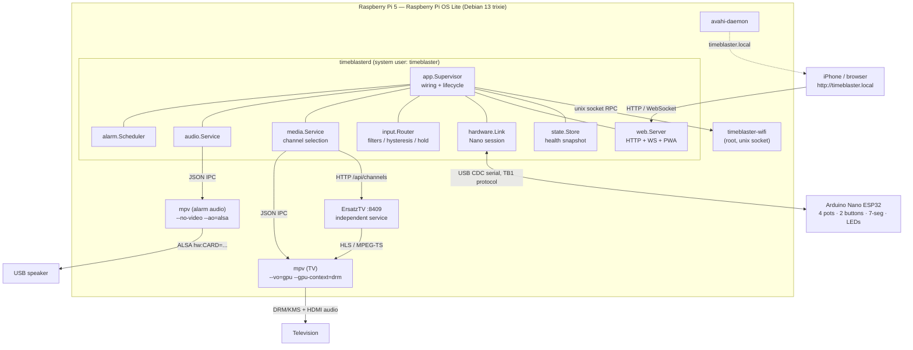

# Timeblaster — Architecture

This document is the design of record. It covers, in order:

1. [Repository layout](#1-repository-layout)
2. [Major components and responsibilities](#2-major-components-and-responsibilities)
3. [Interfaces between components](#3-interfaces-between-components)
4. [Service architecture](#4-service-architecture)
5. [Data and state model](#5-data-and-state-model)
6. [Serial protocol design](#6-serial-protocol-design)
7. [Hardware assumptions](#7-hardware-assumptions)
8. [Audio routing strategy](#8-audio-routing-strategy)
9. [Installation strategy](#9-installation-strategy)

---

## System overview



### Design rules that drive everything below

| Rule | Consequence |
| --- | --- |
| The alarm clock is the highest-priority function. | `alarm.Scheduler` depends only on `storage`, `Clock`, and `audio`. It has no dependency on ErsatzTV, mpv, Wi-Fi, the Nano, or the web server. |
| The Pi owns all policy. | The Nano reports raw events and renders what it is told. No thresholds, channel maps or hold timers in firmware. |
| Every out-of-process thing is an interface. | Serial, mpv, ErsatzTV, ALSA, Wi-Fi, clock and storage all have fakes; the full app graph runs on a dev Mac. |
| One subsystem failing must not take down another. | Subsystems are supervised goroutines with independent backoff; a panic in one is recovered and logged, not propagated. |
| Physical knobs beat software. | Pot 1 is the authoritative alarm volume. Persisted volume is *not* replayed over the knob at boot. |

---

## 1. Repository layout

```text
.
├── cmd/
│   ├── timeblasterd/          # main daemon (unprivileged)
│   ├── timeblaster-wifi/      # privileged network helper (root, unix socket RPC)
│   └── tbctl/                 # small operator/diagnostic CLI
├── internal/
│   ├── alarm/                 # alarm model, occurrence maths, scheduler, snooze/dismiss
│   ├── app/                   # composition root: builds and supervises everything
│   ├── audio/                 # AudioService: alarm playback + volume + sound library
│   ├── config/                # TOML config, defaults, validation
│   ├── ersatztv/              # ErsatzTV HTTP client + channel model + URL building
│   ├── hardware/              # Nano session: framing, dispatch, time sync, display/LED
│   ├── input/                 # filtering, calibration, deadband, hysteresis, hold detect
│   ├── logging/               # slog setup (journald-friendly text / JSON)
│   ├── media/                 # channel service: pot -> channel -> mpv -> overlay
│   ├── mpv/                   # mpv process supervisor + JSON IPC client + OSD overlay
│   ├── protocol/              # TB1 wire format: encode/decode/validate (no I/O)
│   ├── serialport/            # Transport interface, real serial, loopback fake, reconnect
│   ├── state/                 # runtime state + health snapshot + change broadcast
│   ├── storage/               # SQLite store, migrations, settings KV
│   ├── system/                # Clock, CommandRunner, ALSA device discovery
│   ├── web/                   # HTTP API, PWA static embedding, health endpoint
│   │   └── static/            # the PWA, embedded into the binary at build time
│   ├── wifi/                  # helper protocol, client, server implementation, portal
│   └── wsocket/               # WebSocket hub and event fan-out
├── firmware/timeblaster-nano/ # Arduino Nano ESP32 firmware (PlatformIO)
├── deploy/                    # systemd units, config, udev, avahi, assets
├── docs/                      # this file and friends
└── scripts/                   # helper scripts used by setup.sh and the Makefile
```

Import direction is strictly one-way:

```text
protocol ─┐
system   ─┼→ input ─┐
config   ─┤         ├→ hardware ─┐
storage  ─┴→ alarm ─┤            ├→ app → cmd/timeblasterd
             audio ─┤            │
      ersatztv,mpv ─┴→ media ────┤
              wifi, state, web ──┘
```

`internal/app` is the only package allowed to know about all the others. Nothing below `app`
imports `app`. Business-logic packages (`alarm`, `input`, `protocol`, `media`) never import
`os/exec`, `net/http` clients, or `go.bug.st/serial`.

---

## 2. Major components and responsibilities

| Package | Owns | Explicitly does not own |
| --- | --- | --- |
| `config` | Parsing `/etc/timeblaster/timeblaster.toml`, defaults, validation, duration types. | Reacting to config; no live reload in v1 (documented TODO). |
| `storage` | SQLite schema + migrations, alarm CRUD, settings key/value, durable writes (WAL + `synchronous=FULL`). | Business rules about alarms. |
| `alarm` | Alarm model, recurrence maths, DST-correct next-occurrence, firing, snooze, dismiss, missed-alarm catch-up policy. | Sound decoding, device selection, serial. |
| `audio` | Sound library (enumerate/validate MP3s), alarm playback lifecycle, volume application, fallback tone, device health. | Which alarm should ring and when. |
| `input` | Turning raw ADC ints into stable, meaningful, typed events: EMA filter, calibration, deadband, hysteresis band mapping, button hold detection. | Serial I/O, what a channel means. |
| `protocol` | The `TB1` wire format: frame, escape, checksum, encode, decode, sequence. Pure functions. | Ports, reconnects. |
| `serialport` | `Transport` interface, real USB CDC implementation, stable-path resolution, reconnect/backoff, fake transport for tests. | Message semantics. |
| `hardware` | The Nano *session*: read loop, write queue, heartbeat/liveness, time sync cadence, display/LED command API, resync on reconnect. | Deciding display content policy (that is `app`/`media`/`alarm`). |
| `ersatztv` | HTTP client for `/api/channels`, health probe, channel sorting, stream URL construction, retry/backoff. | Playback. |
| `mpv` | Spawning/supervising mpv, the JSON IPC client, property get/set, `loadfile`, `osd-overlay` ASS overlays, crash recovery. | Channel semantics. |
| `media` | The channel service: current channel, channel list refresh, pot-position→channel mapping, overlay text, no-channel image. | Alarm anything. |
| `wifi` | Helper RPC protocol + client (in daemon) + server (in root helper): AP up/down, scan, connect-with-rollback, status, captive portal. | Anything not networking. |
| `state` | Central observable runtime state + health snapshot; single place the API and WebSocket read from. | Mutating hardware. |
| `web` | HTTP routing, JSON API, validation, static PWA, `/api/health`. | Business logic (delegates to services). |
| `wsocket` | WebSocket hub, subscribe/broadcast, backpressure (slow clients dropped, never block). | Event semantics. |
| `app` | Composition root, dependency injection, subsystem supervision, event routing between subsystems, graceful shutdown ordering. | Any domain logic of its own. |

### Event routing owned by `app`

`app` is deliberately the only place where cross-subsystem policy lives, so the policy is
readable in one file (`internal/app/router.go`):

```text
input.PotEvent{Channel:0} → media.SelectByPosition(pos)
input.PotEvent{Channel:1} → audio.SetAlarmVolume(pct) → state + broadcast
input.PotEvent{Channel:2,3} → TODO: unassigned (logged at debug only)
input.ButtonHold{WIFI, 5s} → wifi.EnterSetupMode() → hardware.ShowText("SETUP")
input.ButtonPress{ALARM_OFF} → if alarm active: alarm.DismissActive()
alarm.Fired → audio.PlayAlarm() + hardware.SetAlarmActive(true)
alarm.Ended → audio.StopAlarm() + hardware.SetAlarmActive(false)
serial.Connected → hardware.Resync (time, alarm state, display on/off, LEDs)
```

---

## 3. Interfaces between components

These are the seams that make the system testable. All live next to their consumer.

```go
// system — time and process execution
type Clock interface {
    Now() time.Time
    NewTimer(d time.Duration) Timer
    Since(t time.Time) time.Duration
}
type CommandRunner interface {
    Run(ctx context.Context, name string, args ...string) ([]byte, error)
}

// serialport — the only thing that touches a tty
type Transport interface {
    io.ReadWriteCloser
}
type Opener interface {
    Open(ctx context.Context) (Transport, error) // resolves stable path, opens, configures
}

// hardware — what the rest of the app can ask of the Nano
type Nano interface {
    SetTime(t time.Time) error
    SetAlarmActive(active bool) error
    ShowText(text string, hold time.Duration) error
    ClearText() error
    SetDisplayOn(on bool) error
    SetLED(name string, on bool) error
    Connected() bool
}

// audio — alarm sound output
type Service interface {
    PlayAlarm(ctx context.Context, sound SoundID) error
    StopAlarm() error
    TestAlarm(ctx context.Context, sound SoundID, d time.Duration) error
    SetAlarmVolume(pct int) error
    Volume() int
    IsPlaying() bool
    Sounds() []Sound
    Healthy() (bool, string)
}

// mpv — one interface, two instances (TV and alarm)
type Controller interface {
    Command(ctx context.Context, args ...any) (json.RawMessage, error)
    SetProperty(ctx context.Context, name string, value any) error
    GetProperty(ctx context.Context, name string, out any) error
    LoadFile(ctx context.Context, url string) error
    Alive() bool
}

// ersatztv
type Client interface {
    Channels(ctx context.Context) ([]Channel, error)
    StreamURL(ch Channel) string
    Ping(ctx context.Context) error
}

// storage
type Store interface {
    Alarms() ([]alarm.Alarm, error)
    SaveAlarm(a alarm.Alarm) (alarm.Alarm, error)
    DeleteAlarm(id int64) error
    GetSetting(key string) (string, bool, error)
    SetSetting(key, value string) error
    Close() error
}

// wifi — the daemon only ever speaks this
type Manager interface {
    Status(ctx context.Context) (Status, error)
    EnterSetupMode(ctx context.Context) error
    ExitSetupMode(ctx context.Context) error
    Scan(ctx context.Context) ([]Network, error)
    Connect(ctx context.Context, ssid, psk string) (ConnectResult, error)
}
```

Every one of these has a fake in `_test.go` files or an exported `Fake*` type, and the
supervisor graph in `app` is constructed from a `Deps` struct so tests substitute any of them.

---

## 4. Service architecture

Four systemd units, deliberately independent:

```text
timeblaster.service        unprivileged (User=timeblaster), Restart=always
                           the alarm clock + web + hardware + media
timeblaster-wifi.service   root, socket-activated-style unix socket at
                           /run/timeblaster/wifi.sock, group-owned by timeblaster
ersatztv.service           its own user, own restart policy, own failure domain
avahi-daemon.service       stock, publishes timeblaster.local + _http._tcp
```

Failure isolation:

| Failure | Result |
| --- | --- |
| ErsatzTV crashes / is slow to start | `media` marks channels stale, retries with backoff; alarms unaffected. |
| TV mpv crashes | `mpv.Supervisor` restarts it with backoff, reloads last channel; alarms unaffected. |
| Alarm mpv crashes mid-alarm | `audio` restarts it once and replays; if that fails, falls back to the built-in tone; alarm stays "active" so the red button still works. |
| Nano unplugged | `serialport` reconnect loop with backoff; all Pi-side function continues; on reconnect the Nano is fully resynced. |
| USB speaker unplugged | logged; `audio.Healthy()` false; alarm still fires and is still dismissible. |
| Wi-Fi down | Nothing in the alarm path touches the network. |
| `timeblaster-wifi` down | The daemon's Wi-Fi calls fail cleanly with an error surfaced in `/api/health`. |

`timeblaster.service` hardening: `NoNewPrivileges`, `ProtectSystem=strict`,
`ProtectHome`, `PrivateTmp`, `ReadWritePaths=/var/lib/timeblaster /run/timeblaster`,
and supplementary groups `dialout` (serial), `audio` (ALSA), `video`+`render` (DRM/KMS).

---

## 5. Data and state model

Durable state lives in SQLite at `/var/lib/timeblaster/timeblaster.db`
(WAL, `synchronous=FULL`, `busy_timeout`), which gives atomic, crash-safe writes.

```sql
CREATE TABLE alarms (
  id            INTEGER PRIMARY KEY,
  label         TEXT    NOT NULL DEFAULT '',
  hour          INTEGER NOT NULL,     -- 0-23, local wall time
  minute        INTEGER NOT NULL,     -- 0-59
  enabled       INTEGER NOT NULL DEFAULT 1,
  repeat_days   INTEGER NOT NULL DEFAULT 0,  -- bitmask, bit0=Sunday; 0 => one-shot
  one_shot_date TEXT    NOT NULL DEFAULT '', -- YYYY-MM-DD, optional explicit date
  sound_id      TEXT    NOT NULL DEFAULT '',
  snooze_min    INTEGER NOT NULL DEFAULT 9,
  auto_stop_min INTEGER NOT NULL DEFAULT 15,
  last_fired    INTEGER NOT NULL DEFAULT 0,  -- unix seconds, de-dupe + catch-up
  created_at    INTEGER NOT NULL,
  updated_at    INTEGER NOT NULL
);
CREATE TABLE settings (key TEXT PRIMARY KEY, value TEXT NOT NULL, updated_at INTEGER NOT NULL);
CREATE TABLE schema_migrations (version INTEGER PRIMARY KEY, applied_at INTEGER NOT NULL);
```

Settings keys (all strings, typed accessors in `storage`):
`timezone`, `clock_24h`, `display_on`, `default_sound_id`, `last_channel_number`,
`restore_channel_on_boot`, `alarm_volume_last_seen` (diagnostic only — never replayed).

**Transient state** (`internal/state`) is in-memory only and never persisted: raw and
filtered ADC values, current pot positions, Nano link status, mpv liveness, ErsatzTV
reachability, current channel, active-alarm record, Wi-Fi mode. It is the single source
for `/api/health` and for WebSocket broadcasts.

**Volume policy.** The knob is authoritative. At boot the daemon starts at
`audio.startup_volume_percent` (default 40) and marks volume `provisional`. The first
Pot 1 report promotes it to `authoritative` and applies it. The API exposes volume as
read-only by default (`audio.allow_software_volume = false`); when enabled, a software
set is honoured until the next physical knob movement, which always wins — this is the
documented conflict-resolution policy.

---

## 6. Serial protocol design

Full specification in [serial-protocol.md](serial-protocol.md). Summary:

```text
<STX> TB1 | SEQ | TYPE | arg | arg ... | CRC <LF>
  0x02  ^-------------- checksummed region --------^  0x0A
```

* **Framing** — `0x02` starts a frame, `\n` ends it. Anything before an `STX` is discarded,
  so a mid-line reconnect resynchronises on the next frame instead of corrupting state.
* **Version** — the literal `TB1` is field 0. A peer seeing an unknown version logs and drops.
* **Sequence** — `SEQ` is `0..4095`, per-direction, wrapping. Used for `ACK`/`NAK` of
  commands that matter and for detecting dropped frames in logs.
* **Checksum** — CRC-8 (poly 0x07) over the region between `STX` and the final `|`,
  hex-encoded. USB CDC is already reliable; the CRC is cheap and catches truncation from a
  half-open reconnect, which is the realistic failure here.
* **Escaping** — payload bytes `|`, `\n`, `\r`, `\` and `0x02` are backslash-escaped so
  display text can contain anything.
* **Liveness** — the Nano sends `HELLO` on boot and `PING` every 2 s; the Pi replies `PONG`.
  Three missed pings (6 s) marks the link dead and triggers a reopen.
* **Malformed input** — counted, rate-limited-logged, and dropped. Never fatal, never
  retried blindly.

Nano → Pi: `HELLO`, `PING`, `POT`, `BUTTON`, `ACK`, `NAK`, `LOG`.
Pi → Nano: `PONG`, `TIME`, `ALARM`, `DISPLAY`, `LED`, `CONFIG`, `ACK`.

**Time sync.** `TIME` carries unix seconds + UTC offset + milliseconds-into-second. The Nano
free-runs its display from `millis()` between syncs. The Pi sends `TIME` on connect, then
every `serial.time_sync_interval` (default 60 s), and immediately on timezone change, DST
transition, NTP step, and alarm state change. The display therefore never freezes because
Linux was briefly busy.

---

## 7. Hardware assumptions

Detailed pinout in [hardware.md](hardware.md).

* **Board**: Arduino Nano ESP32 (ESP32-S3), 3.3 V logic, USB CDC serial at 115200 8N1.
* **ADC**: 12-bit (0–4095) on A0–A3. The ESP32 ADC is noisy and non-linear near the rails,
  so the firmware oversamples 16× and applies an EMA, and the Pi applies calibration with
  configurable end margins (default: treat ≤2 % as 0 % and ≥98 % as 100 %).
* **Pots**: 10 kΩ linear, wired 3V3 / wiper→A*n* / GND. A0=channel, A1=alarm volume,
  A2/A3 reserved (**TODO**: unassigned; `input` already emits typed events for them).
* **Buttons**: momentary, wired pin→GND with `INPUT_PULLUP`; active-low. D2 = Wi-Fi setup,
  D3 = big red Alarm Off. Firmware debounces 25 ms and reports edges only; the 5-second
  hold is measured in Go.
* **Display**: 4-digit 7-segment, driven by the Nano. The firmware exposes a text/number
  abstraction; the Pi never addresses segments.
* **LEDs**: named logical LEDs (`ALARM`, `WIFI`, `POWER`) so the Pi is not wired to pin
  numbers.
* **Power/USB**: the Nano is powered from the Pi's USB. A reboot of the Pi resets the Nano;
  the `HELLO`/resync path covers that.

The Pi opens the Nano by stable path — `/dev/serial/by-id/*` glob first, falling back to a
udev-created `/dev/timeblaster-nano` symlink, never a bare `/dev/ttyACM0`.

---

## 8. Audio routing strategy

Two completely independent paths that never share a process, a device, or a mixer:

```text
TV / media audio          Alarm audio
mpv (TV instance)         mpv (alarm instance, --no-video)
  --audio-device=          --audio-device=alsa/<stable-id>
  auto (HDMI)              --ao=alsa
     │                          │
   HDMI                    USB audio card
     ▼                          ▼
    TV                       Speaker
```

* The alarm device is **explicitly configured**, never "the default". Configuration accepts
  a stable ALSA identifier such as `alsa/hw:CARD=Device,DEV=0` or, preferably,
  `audio.alarm_device_match = "USB"`, which `system.FindALSACard` resolves against
  `/proc/asound/cards` at startup and again on reconnect, so card *numbers* changing does
  not break anything.
* Volume is applied to the USB card's own mixer control via `amixer -c <card> sset <ctl> N%`
  when a hardware control exists (discovered once, cached), with mpv's software `volume`
  property as the fallback. Both paths are behind `system.CommandRunner`/`mpv.Controller`,
  so command generation is unit-tested without hardware.
* Starting an alarm issues no commands at all to the TV mpv instance — video keeps playing.
* Missing/corrupt MP3 → `audio` validates the file (existence, size, MP3/ID3 magic) at
  selection time and at play time; on failure it walks the sound library for any other
  playable file, and if none exists it plays a built-in generated fallback tone
  (a synthesized WAV written to `/run/timeblaster`), so an alarm always makes noise.

---

## 9. Installation strategy

`sudo ./setup.sh` on a fresh Raspberry Pi OS Lite (Debian 13 trixie, arm64). The script is
idempotent and non-destructive; each step detects completed work and skips it.

Order of operations:

1. Preflight: root check, `/etc/os-release` is Debian-family, architecture is `arm64`
   (warn but continue on `armhf`), free space, network reachability.
2. `apt-get update` (only if the metadata is older than an hour) and install:
   `mpv`, `alsa-utils`, `avahi-daemon`, `libnss-mdns`, `network-manager`, `dnsmasq-base`,
   `sqlite3`, `ca-certificates`, `curl`, `jq`, `golang-go` (or a pinned upstream Go if the
   packaged one is too old to build the module).
3. Create system user `timeblaster` (no shell, no home login) and add it to
   `dialout audio video render`.
4. Directory tree: `/etc/timeblaster`, `/var/lib/timeblaster/alarm-sounds`,
   `/var/log` via journald only, `/usr/share/timeblaster/assets`, `/run` via systemd.
5. Build `timeblasterd`, `timeblaster-wifi`, `tbctl`; install to `/usr/local/bin`.
6. Install config **without clobbering**: if `/etc/timeblaster/timeblaster.toml` exists,
   write `timeblaster.toml.new` alongside it and report the difference instead.
7. Install assets (generating a default `no-channel.png` if none is present), udev rule for
   the Nano symlink, Avahi service file, hostname `timeblaster`.
8. ErsatzTV: download the current `linux-arm64` tarball from GitHub releases into
   `/opt/ersatztv`, create the `ersatztv` user and unit, unless already installed at the
   same version.
9. Console suppression on the TV: append `vt.global_cursor_default=0` / `consoleblank=0` to
   `cmdline.txt` and note that a reboot is required — the script never reboots by itself.
10. `systemctl daemon-reload`, enable units, then print a status summary with next steps.

Reruns re-verify and re-report; nothing is deleted, and user-modified files are preserved.
